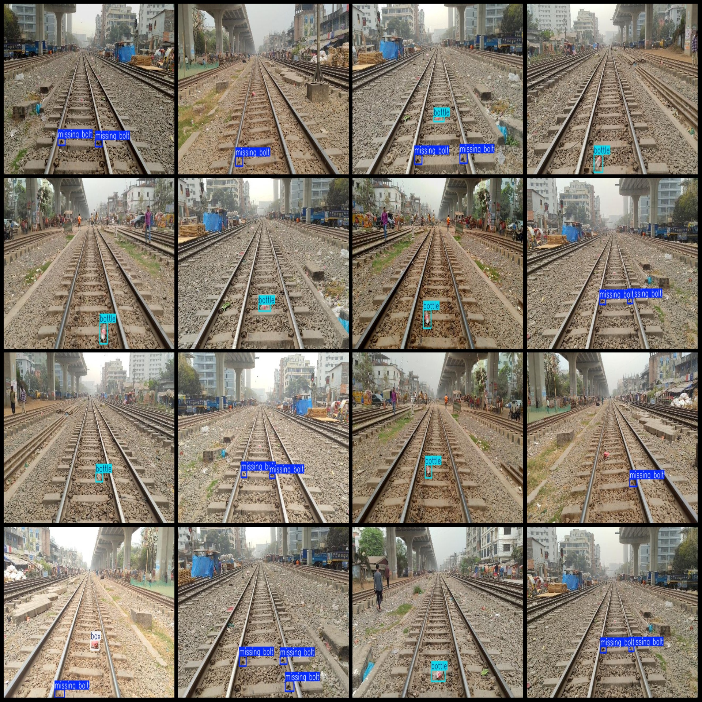
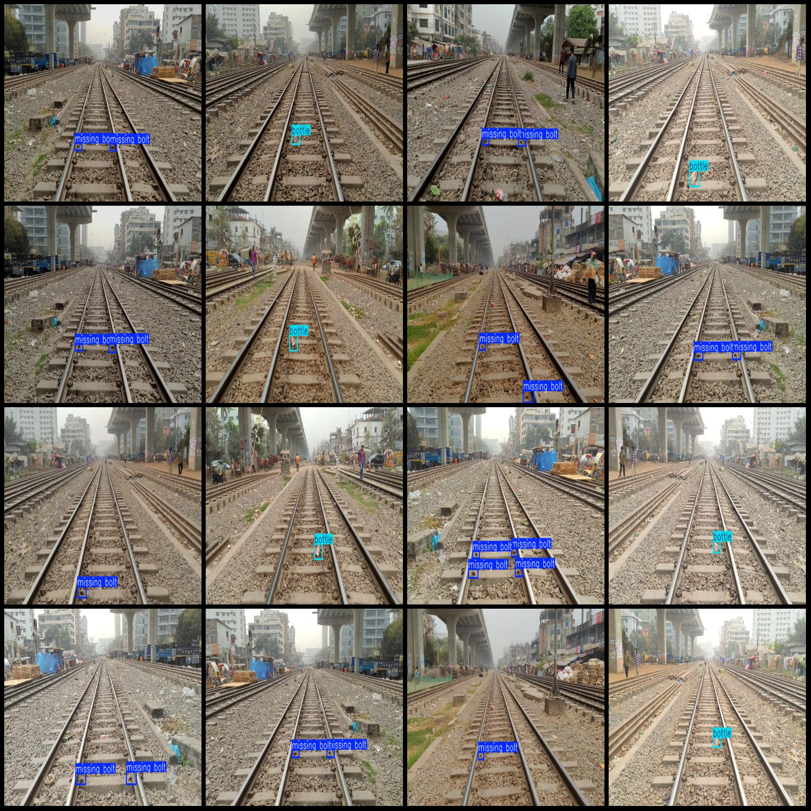

# Smart Railway Track Safety Bolt Missing Foreign Object Detection Dataset (VOC+YOLO format) - 2105 images, 3 categories with enhancements

Please note that the original dataset contains only about 240 images, with the remaining being enhanced images. All images are taken from a single scene. Please pay attention to the images.

The dataset is in Pascal VOC format plus YOLO format (excluding the split path in the txt file, only containing jpg images and corresponding VOC format xml files and YOLO format txt files).

Number of images (jpg file count): 2105
Number of annotations (xml file count): 2105
Number of annotations (txt file count): 2105
Number of annotation categories: 3
Annotation category names (Note that the order of labels in the YOLO format does not correspond to this, but rather to the "labels" folder's "classes.txt"): ["bottle", "box", "missing bolt"]

Each category has the number of bounding boxes:
- Bottle = 831
- Box = 170
- Missing bolt = 2663
Total bounding box count = 3664

Each category occupies the number of images:
- Bottle occupies 831 images
- Box occupies 170 images
- Missing bolt occupies 1409 images

Image resolution: 640x360

Annotation tool used: labelImg
Annotation rules: draw bounding boxes for categories

Important notice: The dataset does not have been split into training, validation, or test sets, and you need to do it yourself.

Special declaration: This dataset does not guarantee any accuracy of the trained model or weight files.

Image preview:

Annotation example:
## Images

Here is a pay link on Stripe ( https://buy.stripe.com/3cs8yP7sY87d0vu9AB ). Please contact me lonlonago@foxmail.com after funding $89, and I will send you a complete data files , thank you!

